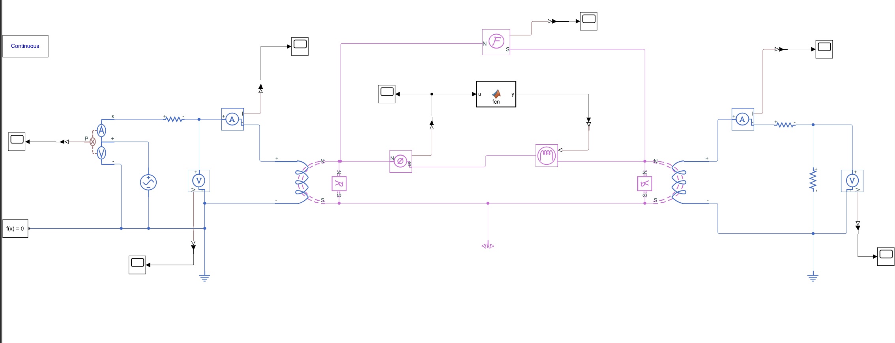

# MATLAB-Transformer-Model

This repository presents a detailed simulation and analysis of a single-phase transformer using MATLAB and Simulink. The project involves modeling the magnetic circuit, determining winding specifications, and extracting the transformer's equivalent circuit through simulation.

---

## 📚 Project Overview
The goal of this project is to design and simulate a UI-core transformer with the following key specifications:
- **Primary Voltage**: 230V RMS
- **Core Type**: UI laminated core (Electrical-Steel-NGO-35PN250)
- **Core Magnetic Properties**: Characterized using BH curves fitted with MATLAB's Curve Fitting Toolbox.

---

## 📝 Design & Simulation Procedure

### 1️⃣ Core Selection & Magnetic Characterization
- Selected a UI-core with dimensions determined by the project requirements.
- The core’s BH curve was extracted from provided data and mathematically fitted using exponential functions in MATLAB.

### 2️⃣ Winding Design
- Calculated the number of turns (N) and core cross-sectional area (A) using:
  - \( V_{rms} = 4.44 \times N \times f \times A \times B_{max} \)
- Chose a maximum flux density \( B_{max} = 0.9 \) T and frequency \( f = 50 \) Hz.

### 3️⃣ Simulink Model Development
- Built the transformer model in Simulink using **Simscape – Foundation Library** and **Magnetics** components.
- Used an **Electromagnetic Converter (EC)** block to connect electrical and magnetic domains.
- Included nonlinear magnetic reluctance to represent the core’s behavior.

### 4️⃣ Simulation Scenarios
- **Open-circuit and short-circuit tests** were conducted to determine equivalent circuit parameters.
- Various load resistances were simulated to observe:
  - Flux waveform (\( \Phi \))
  - Input and output voltages (\( V_{in}, V_{out} \))
  - Input and output currents (\( I_{in}, I_{out} \))
  - Effects of leakage inductance and core saturation.

### 5️⃣ Data Analysis
- Compared simulation results with theoretical calculations.
- Verified that the transformer’s turn ratio and flux density matched design specifications.
- Analyzed reasons for any waveform distortions or deviations.

---

## 📈 Transformer Circuit Diagram
The following diagram illustrates the Simulink model of the transformer used in this project:

---

## ⚠️ Key Considerations
- Both electrical sides were grounded for stable simulation.
- Proper solver configuration was set with a simulation time of at least 0.1s (5 cycles at 50Hz).
- Used **Simulink-PS Converter** and **PS-Simulink Converter** for interfacing physical and normal signals.
- Ensured correct MMF source polarity to prevent unstable behavior.

---

### 👥 Contributors
- **Amir Shahang**
- **Helia Zolghadr**

