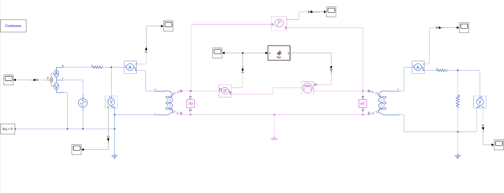

# MATLAB-Transformer-Model
This project aims to simulate a single-phase transformer using MATLAB and Simulink, focusing on magnetic circuit modeling, equivalent circuit extraction, and system behavior analysis under different load conditions.

## 📚 Project Overview
In this project, we design and simulate a transformer supplied by a 230V RMS AC source. The transformer uses a UI-type laminated core made of **Electrical-Steel-NGO-35PN250**, with its magnetic behavior fitted to a **BH curve** using MATLAB’s Curve Fitting Toolbox.

### 🔍 Objectives
- **Simulate the magnetic circuit** of a transformer in Simulink’s Simscape and Foundation Library.
- **Design winding specifications** (number of turns and cross-sectional area).
- **Extract the equivalent circuit** of the transformer via open-circuit and short-circuit tests.
- **Analyze the system’s behavior** with varying load resistances and observe current, flux, and voltage waveforms.

## 🛠️ Tools & Libraries
- **MATLAB & Simulink**
- **Simscape – Foundation Library**
- **Curve Fitting Toolbox**

## 📝 Implementation Steps
1. **Core Selection**: Use a UI core with specified dimensions and material properties.
2. **Magnetic Model**: Fit the core’s BH curve using exponential functions in MATLAB.
3. **Design Calculations**:
   - Determine primary and secondary winding specifications.
   - Calculate core cross-sectional area based on flux density and voltage.
4. **Simulink Model**:
   - Build a magnetic circuit using Simscape’s Magnetics components.
   - Include an Electromagnetic Converter (EC) linking electrical and magnetic domains.
   - Add variable reluctance and MMF sources to represent nonlinear magnetic properties.
5. **Load Testing**:
   - Simulate open-circuit and short-circuit conditions.
   - Adjust load resistance values and analyze waveforms.
6. **Data Analysis**:
   - Observe current and flux waveforms.
   - Check if transformer ratio and flux density match design expectations.
   - Consider leakage flux effects by adding parallel reluctances.

## 📈 Transformer Circuit Diagram
Here is the schematic diagram of the simulated transformer:

## ⚠️ Important Notes
- Ensure **both electrical sides are grounded** in Simulink.
- Use a **Magnetic Reference** and a **Solver Configuration** block for simulation stability.
- **Run the simulation for at least 0.1s** (equivalent to 5 cycles at 50Hz).
- Use **Simulink-PS Converter** and **PS-Simulink Converter** for signal conversion between physical and normal signals.
- Pay attention to **MMF source polarity** to prevent unstable simulation behavior.

## 📈 Deliverables
- MATLAB files including:
  - Magnetic curve fitting functions.
  - Simulink model files (.slx).
- PDF report detailing:
  - Transformer design calculations.
  - Simulink model diagrams.
  - Simulation results and waveform analyses.

## 📅 Submission Deadline
- **Date**: Ordibehesht 30, 23:55
- **Format**: Submit both PDF report and MATLAB files to the course platform.

## 💡 Tips for Success
- Make sure all parts of the model are correctly grounded and configured.
- Analyze the reasons for non-sinusoidal behavior if observed.
- Ensure the design adheres to the selected core’s properties and fits the practical expectations.

### 👥 Contributors
- **Behzad Shayegh**
- **Aref Afzali**

---

Happy simulating! 🚀
